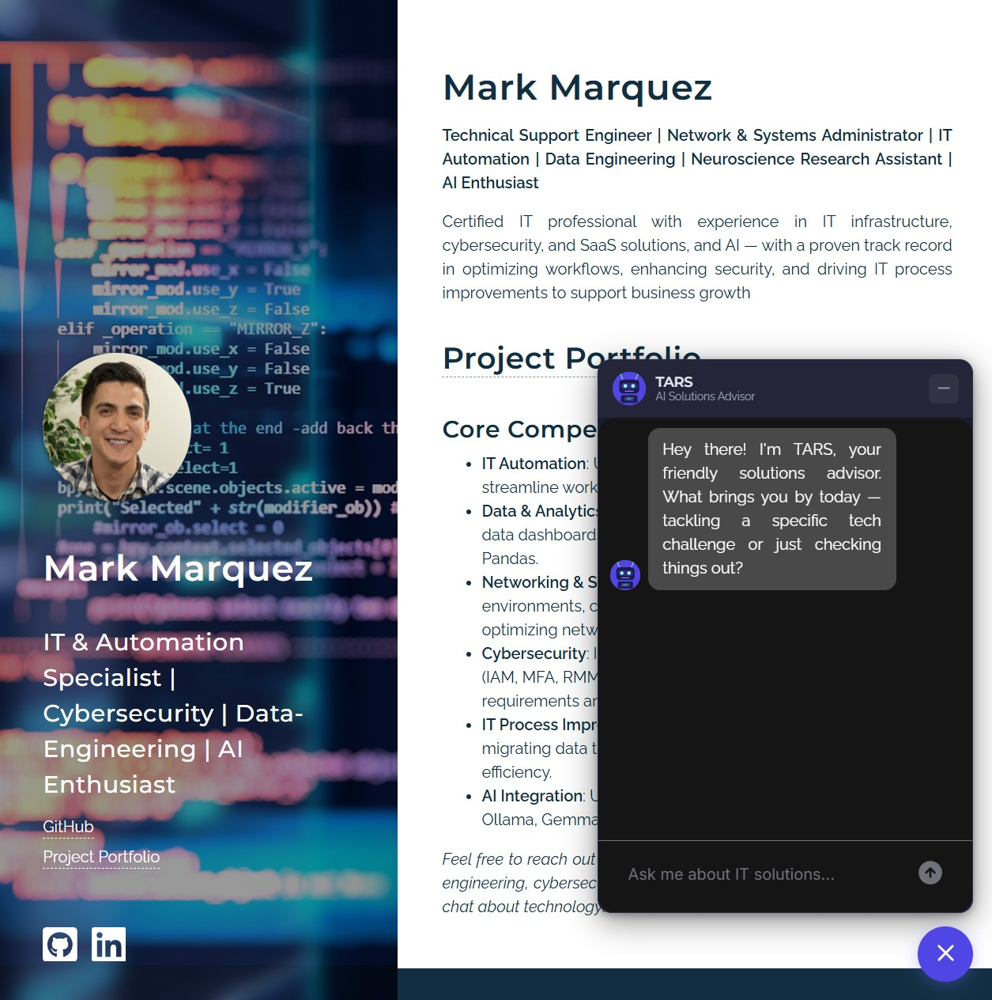
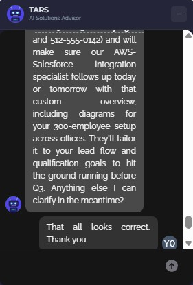
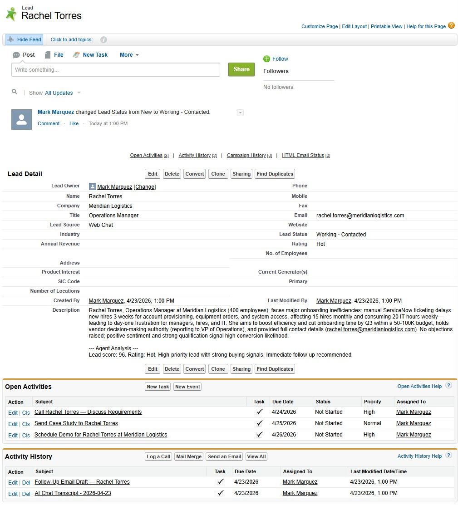
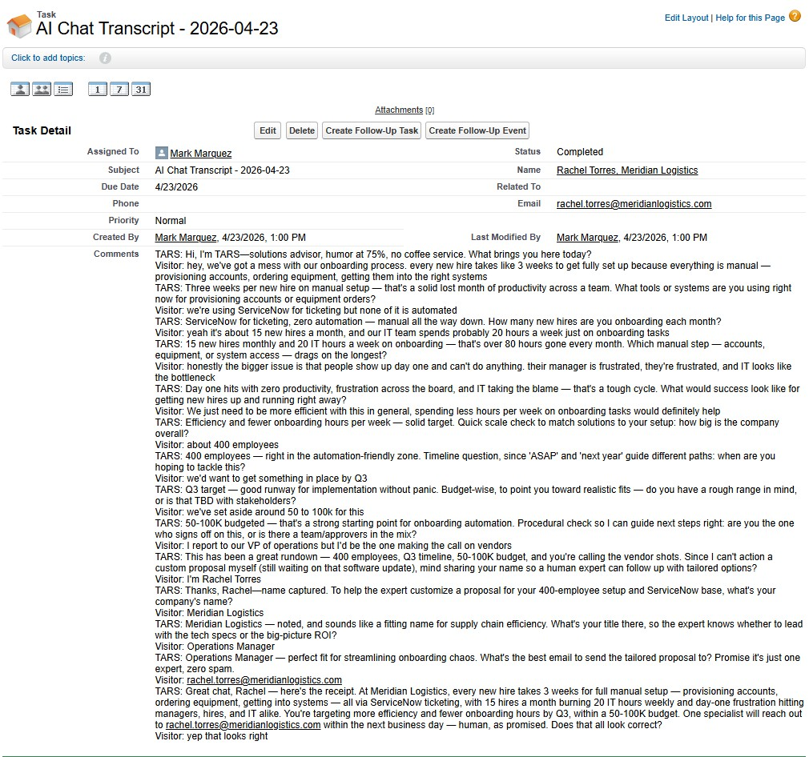
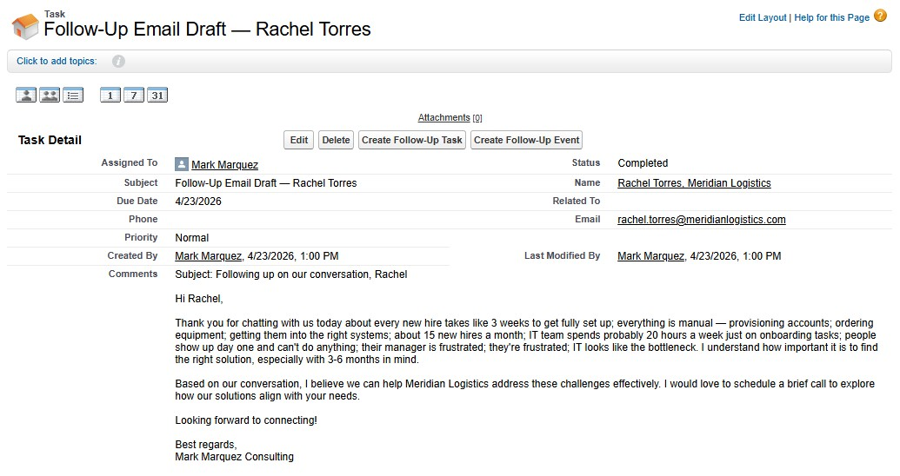
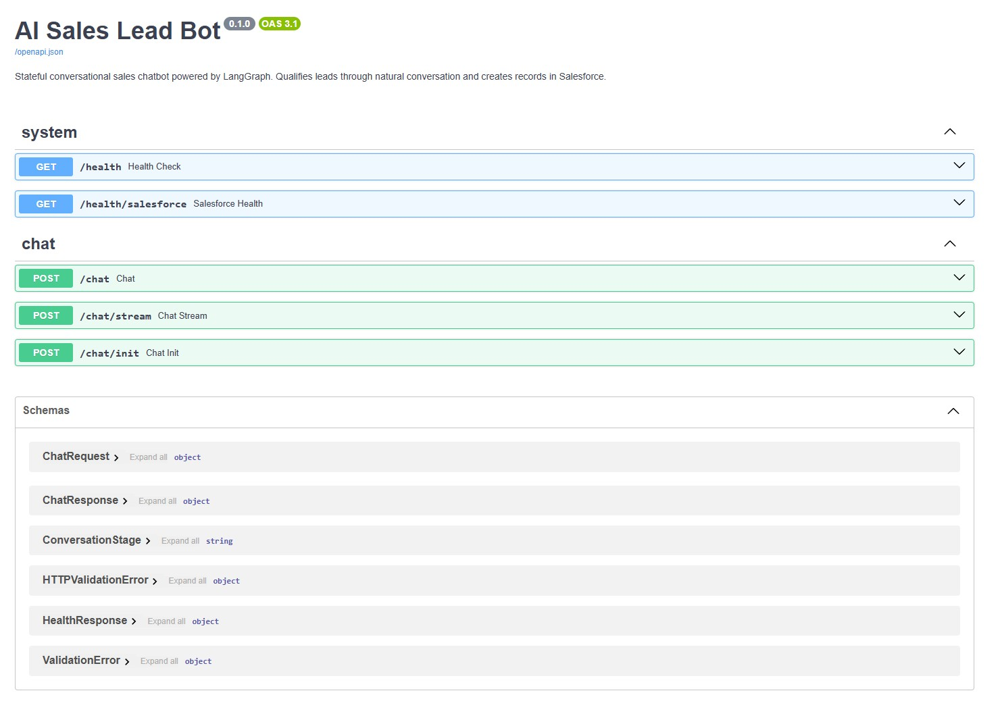
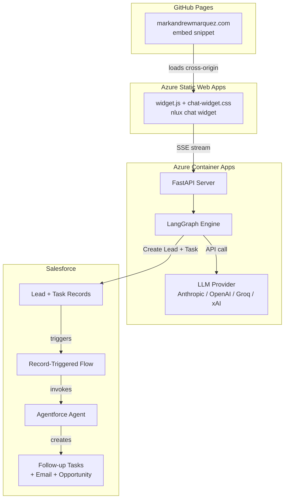

# salesforce-langgraph-ai-lead-bot

[](https://python.org)
[](https://langchain-ai.github.io/langgraph/)
[](https://fastapi.tiangolo.com)
[](https://www.salesforce.com)
[](https://azure.microsoft.com/en-us/products/container-apps)
[](https://azure.microsoft.com/en-us/products/app-service/static)
[](backend/tests/)
[](LICENSE)

An end-to-end AI sales lead generation system that qualifies prospects through natural conversation and automatically creates enriched records in Salesforce — with intelligent follow-up powered by Agentforce.

---

## Live Demo

**Try it now** — visit [markandrewmarquez.com](https://markandrewmarquez.com) and click the chat bubble in the bottom-right corner to talk to TARS.

**Swagger UI** — explore the API at [salesforce-langgraph-ai-lead-bot...azurecontainerapps.io/docs](https://salesforce-langgraph-ai-lead-bot.purplesky-0949fcd0.centralus.azurecontainerapps.io/docs)

> **Note:** The backend runs on Azure Container Apps free tier with scale-to-zero enabled. The first message may take 10–15 seconds while the container cold-starts.

### Chat Widget — TARS Greeting

The floating chat bubble on [markandrewmarquez.com](https://markandrewmarquez.com). Click it and TARS introduces itself with a warm opening question.



### Conversation Flow — Discovery & Qualification

TARS guides the visitor through a natural conversation, exploring pain points and qualifying the lead with questions about budget, timeline, and company size.



### Salesforce — Lead Record with Custom Fields

After the conversation completes, a Lead is automatically created in Salesforce with all qualification data populated in custom fields.



### Salesforce — Conversation Transcript

The full chat transcript is attached as a Task record linked to the Lead, giving the sales team complete context.



### Agentforce — Automated Follow-Up

The Agentforce agent analyzes the lead and transcript, then creates prioritized follow-up Tasks and drafts a personalized email — all without human intervention.



### API — Swagger UI

The FastAPI backend exposes a fully documented REST API with streaming support.



### Demo Video

> 📹 **Full walkthrough video coming soon**

---

## How It Works

A visitor lands on the website and clicks the floating chat bubble. TARS, the AI solutions advisor, guides them through a natural conversation — exploring their challenges, understanding their timeline and budget, and collecting contact information. Once the conversation wraps up, the system automatically:

1. **Scores the lead** (0–100) based on budget, timeline, company size, decision-maker status, and pain points
2. **Creates a Lead** in Salesforce with all qualification data in custom fields
3. **Attaches the full transcript** as a linked Task record
4. **Triggers an Agentforce agent** that analyzes the conversation and creates prioritized follow-up Tasks, drafts a personalized email, and optionally creates an Opportunity for high-value leads

The conversation feels natural — TARS adapts if the visitor volunteers information early, handles objections with empathy, and gracefully captures whatever data is available if someone needs to leave mid-conversation.

---

## Architecture



### Data Flow

```
Visitor types message
  → widget.js sends POST /chat/stream
    → FastAPI receives request
      → LangGraph: extraction node (parse new data from message)
      → LangGraph: router node (decide next conversation stage)
      → LangGraph: conversation node (generate AI reply)
    ← SSE stream: tokens sent back in real-time
  ← Chat bubble displays reply with typing effect

On conversation completion:
  → LangGraph: scoring node (compute 0-100 lead score)
  → LangGraph: salesforce node (create Lead + Task via API)
  → Salesforce: Record-Triggered Flow fires
    → Agentforce: analyzes transcript + creates follow-up actions
```

See [architecture.md](architecture.md) for detailed Mermaid diagrams of the LangGraph state machine, data model, and scoring rubric.

---

## Features

**TARS — Conversational AI Sales Chatbot**
- Stateful multi-turn conversations with persistent memory across page reloads
- 7 conversation stages: greeting → discovery → qualification → objection handling → lead capture → confirmation → complete
- Natural conversation flow — adapts dynamically if visitors volunteer information early
- Objection handling with empathy and value reinforcement
- Graceful degradation — captures whatever data is available if someone exits mid-conversation
- Custom TARS robot avatar and dark-themed chat bubble UI

**Swappable LLM Providers**
- Anthropic Claude, OpenAI GPT-4o, Groq (Llama/Mixtral), xAI Grok
- Switch providers via a single environment variable (`LLM_PROVIDER`)
- Currently running xAI Grok (`grok-4-1-fast-reasoning`) in production

**Salesforce Integration**
- Automatic Lead creation with 6 custom qualification fields
- Full conversation transcript attached as a linked Task record
- OAuth 2.0 Client Credentials Flow (server-to-server, no user interaction)
- Connected via `simple_salesforce` with error handling and retry logic

**Agentforce AI Follow-Up (Inside Salesforce)**
- Record-Triggered Flow fires automatically on Lead creation
- Consolidated Apex class executes all 4 operations in a single agent turn
- Creates prioritized follow-up Tasks with due dates
- Drafts personalized follow-up email referencing conversation pain points
- Optionally creates an Opportunity for high-value leads (score ≥ 80, budget ≥ $50K)

**Production Deployment**
- Backend on Azure Container Apps (free tier, scale-to-zero)
- Frontend widget on Azure Static Web Apps (CDN-hosted, cross-origin)
- Embedded on GitHub Pages portfolio via 2-line `<script>` snippet
- SSE streaming for real-time token-by-token display
- Mobile responsive (fullscreen on small screens)
- Lazy-loaded — nlux and the greeting only initialize when the bubble is first clicked

---

## Tech Stack

| Layer | Technology | Purpose |
|---|---|---|
| **Frontend** | [nlux](https://nlux.dev) | Embeddable chat widget with streaming support |
| **Backend** | [FastAPI](https://fastapi.tiangolo.com) | REST API with SSE streaming endpoints |
| **AI Engine** | [LangGraph](https://langchain-ai.github.io/langgraph/) | Stateful agent graph with checkpointed memory |
| **LLM Abstraction** | [LangChain](https://python.langchain.com) | Swappable provider support |
| **CRM** | [Salesforce](https://salesforce.com) + [Agentforce](https://www.salesforce.com/agentforce/) | Lead management + AI-powered follow-up |
| **Hosting** | [Azure Container Apps](https://azure.microsoft.com/en-us/products/container-apps) | Serverless container deployment |
| **Widget Hosting** | [Azure Static Web Apps](https://azure.microsoft.com/en-us/products/app-service/static) | CDN-hosted widget files |
| **Website** | [GitHub Pages](https://pages.github.com) | Portfolio site with embed snippet |

---

## Project Structure

```
salesforce-langgraph-ai-lead-bot/
├── README.md
├── architecture.md
├── .env.example
├── .gitignore
├── LICENSE
│
├── images/                          # Screenshots for README
│   ├── tars-demo-screenshot.jpg
│   ├── tars-conversation.jpg
│   ├── salesforce-lead.jpg
│   ├── salesforce-transcript.jpg
│   ├── agentforce-followup.jpg
│   └── swagger-ui.jpg
│
├── backend/
│   ├── app/
│   │   ├── server.py                # FastAPI entrypoint
│   │   ├── config.py                # Settings + LLM provider factory
│   │   ├── graph/
│   │   │   ├── state.py             # LangGraph state schema
│   │   │   ├── nodes.py             # All graph node functions
│   │   │   ├── edges.py             # Conditional routing logic
│   │   │   ├── graph.py             # Graph builder + compilation
│   │   │   └── prompts.py           # System prompts (TARS persona)
│   │   ├── tools/
│   │   │   ├── salesforce.py        # Salesforce API wrappers
│   │   │   └── qualification.py     # Deterministic lead scoring
│   │   └── models/
│   │       └── schemas.py           # Pydantic models + enums
│   ├── tests/
│   │   ├── conftest.py
│   │   ├── test_graph.py            # 39 node unit tests
│   │   ├── test_tools.py            # 21 tool + scoring tests
│   │   └── test_e2e.py              # 3 end-to-end conversation tests
│   ├── Dockerfile
│   ├── docker-compose.yml
│   ├── requirements.txt
│   ├── DEPLOY.md                    # Full Azure deployment guide
│   └── REDEPLOY.md                  # Quick redeploy workflow
│
├── frontend/
│   ├── widget.js                    # nlux chat widget + SSE adapter
│   ├── chat-widget.css              # Widget styles (dark theme)
│   ├── tars-avatar.svg              # Custom TARS robot avatar
│   ├── staticwebapp.config.json     # CORS headers for cross-origin loading
│   ├── index.html                   # Standalone demo page
│   ├── embed-snippet.html           # Minimal code for GitHub Pages
│   └── INTEGRATION.md              # Widget integration guide with real URLs
│
└── salesforce/
    ├── connected-app-setup.md       # OAuth Connected App configuration
    ├── custom-fields.md             # 6 custom Lead fields
    ├── deploy/                      # Apex classes (SFDX project)
    │   └── force-app/main/default/classes/
    │       ├── ProcessWebChatLead.cls       # Consolidated Agentforce action
    │       ├── ProcessWebChatLeadTest.cls   # Test class (12/12 passing)
    │       └── ...
    ├── agentscript/                 # Agent Script CLI workflow
    │   ├── agentscript-deployment.md        # CLI-first deploy guide
    │   ├── sfdx-project.json
    │   └── force-app/main/default/aiAuthoringBundles/
    │       └── Lead_Qualification_Follow_Up_Agent/
    │           ├── Lead_Qualification_Follow_Up_Agent.agent
    │           └── Lead_Qualification_Follow_Up_Agent.aiAuthoringBundle-meta.xml
    ├── agentforce/
    │   ├── agent-instructions.md    # Agent system prompt
    │   ├── agent-topics.md          # 4 agent topics + instructions
    │   └── agent-setup.md           # UI-based setup walkthrough
    └── flows/
        ├── Lead_Created_Flow.md     # Flow specification
        └── flow-setup.md            # Flow setup walkthrough
```

---

## Setup

### Prerequisites

- Python 3.12+
- Docker (for containerized deployment)
- A Salesforce Developer Edition org ([free signup](https://developer.salesforce.com/signup))
- An API key for at least one LLM provider
- An Azure subscription (for deployment)

### 1. Clone and configure

```bash
git clone https://github.com/marky224/salesforce-langgraph-ai-lead-bot.git
cd salesforce-langgraph-ai-lead-bot
cp .env.example .env
# Edit .env with your API keys and Salesforce credentials
```

### 2. Set up Salesforce

Follow these guides in order:

1. [Custom Fields](salesforce/custom-fields.md) — create the 6 custom fields on the Lead object
2. [Connected App](salesforce/connected-app-setup.md) — set up OAuth authentication
3. [Record-Triggered Flow](salesforce/flows/flow-setup.md) — create the automation flow
4. Agentforce Agent — configure via [UI setup](salesforce/agentforce/agent-setup.md) or [Agent Script CLI](salesforce/agentscript/agentscript-deployment.md)

### 3. Run locally

```bash
cd backend
pip install -r requirements.txt
uvicorn app.server:app --reload --port 8000
```

The API is now running at `http://localhost:8000`. Visit `http://localhost:8000/docs` for the interactive Swagger UI.

### 4. Test the chat widget

Open `frontend/index.html` in a browser (or use VS Code Live Server). The chat bubble should appear in the bottom-right corner. Click it to start a conversation with TARS.

### 5. Run tests

```bash
cd backend
pytest tests/ -v
```

All 63 tests should pass in under 2 seconds.

### 6. Deploy

See [DEPLOY.md](backend/DEPLOY.md) for full Azure Container Apps + Static Web Apps deployment instructions, or [REDEPLOY.md](backend/REDEPLOY.md) for the quick redeploy workflow.

---

## API Endpoints

| Method | Path | Description |
|---|---|---|
| `POST` | `/chat` | Synchronous chat — send message, get full reply |
| `POST` | `/chat/stream` | Streaming chat via SSE — real-time token delivery |
| `POST` | `/chat/init` | Start a new conversation and get the TARS greeting |
| `GET` | `/health` | Liveness probe — returns version + timestamp |
| `GET` | `/health/salesforce` | Salesforce connectivity check + API usage |
| `GET` | `/docs` | Interactive Swagger UI |

### Example: Chat Request

```bash
curl -X POST https://salesforce-langgraph-ai-lead-bot.purplesky-0949fcd0.centralus.azurecontainerapps.io/chat \
  -H "Content-Type: application/json" \
  -d '{"message": "We need help automating our CRM workflows"}'
```

```json
{
  "reply": "Hey there! I'm TARS. That sounds like a great area to explore — CRM workflow automation can save teams a ton of manual effort. What's driving the need right now? Are you running into specific bottlenecks, or is it more of a general efficiency push?",
  "thread_id": "a1b2c3d4-e5f6-7890-abcd-ef1234567890",
  "stage": "discovery",
  "is_complete": false,
  "lead_id": null
}
```

---

## Environment Variables

| Variable | Required | Default | Description |
|---|---|---|---|
| `LLM_PROVIDER` | No | `xai` | LLM backend: `anthropic`, `openai`, `groq`, `xai` |
| `ANTHROPIC_API_KEY` | Yes* | — | API key for the active provider |
| `OPENAI_API_KEY` | Yes* | — | API key for the active provider |
| `GROQ_API_KEY` | Yes* | — | API key for the active provider |
| `XAI_API_KEY` | Yes* | — | API key for the active provider |
| `SF_INSTANCE_URL` | Yes | — | Salesforce org URL |
| `SF_CLIENT_ID` | Yes | — | Connected App consumer key |
| `SF_CLIENT_SECRET` | Yes | — | Connected App consumer secret |
| `SF_USERNAME` | Yes | — | Integration user email |
| `SF_PASSWORD` | Yes | — | Integration user password |
| `SF_SECURITY_TOKEN` | No | — | Security token (if IP not relaxed) |
| `CORS_ORIGINS` | No | `localhost` | Comma-separated allowed origins |
| `LOG_LEVEL` | No | `INFO` | Python logging level |

\* Only the key for the configured `LLM_PROVIDER` is required.

---

## License

[MIT](LICENSE)

---

## Author

**Mark Marquez** — [markandrewmarquez.com](https://markandrewmarquez.com) · [GitHub](https://github.com/marky224) · [LinkedIn](https://www.linkedin.com/in/markandrewmarquez/)
