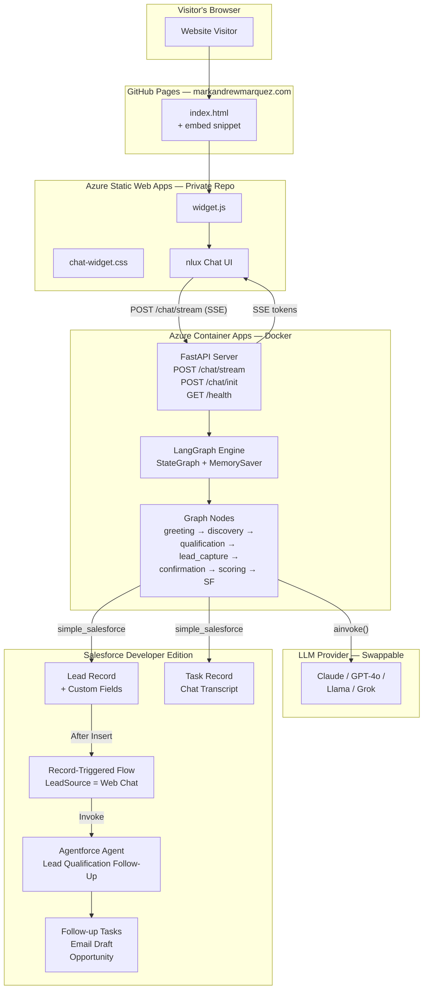
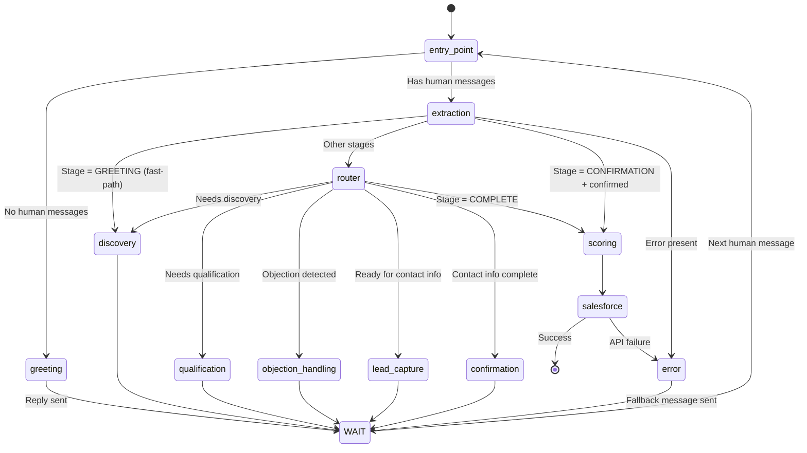
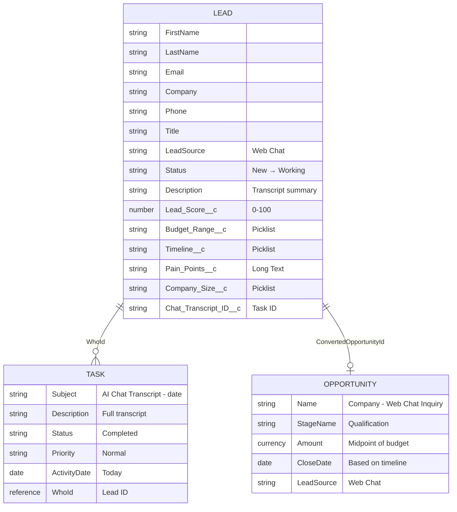
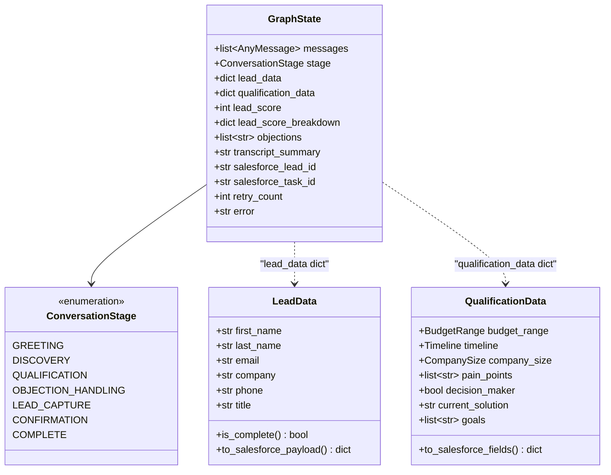
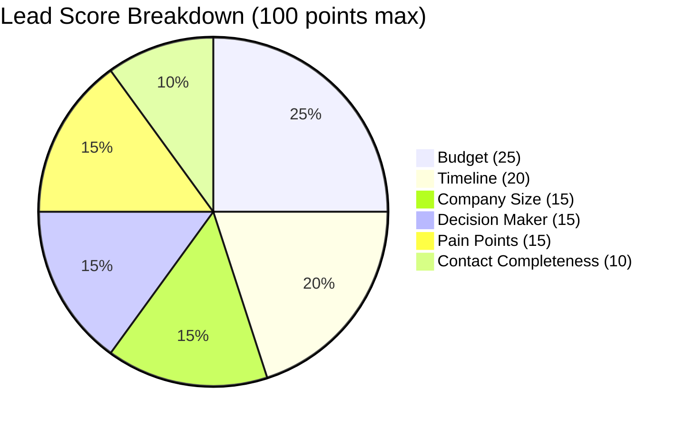

# Architecture

Detailed architecture diagrams for the AI Sales Lead Bot.

---

## System Architecture

---

## LangGraph Conversation Flow

---

## Data Model

---

## Graph State Schema

---

## Scoring Rubric

| Dimension | Points | High Value | Low Value |
|---|---|---|---|
| Budget | 0-25 | $100K+ = 25 pts | Unknown = 0 pts |
| Timeline | 0-20 | Immediate = 20 pts | Just exploring = 2 pts |
| Company Size | 0-15 | 1000+ = 15 pts | 1-10 = 4 pts |
| Decision Maker | 0-15 | Yes = 15 pts | Unknown = 0 pts |
| Pain Points | 0-15 | 3+ = 15 pts | 0 = 0 pts |
| Contact Completeness | 0-10 | All fields = 10 pts | No email = 0 pts |

| Priority | Score Range | Follow-up Actions |
|---|---|---|
| **High** | 70-100 | 3 tasks + email + opportunity (if budget ≥ $50K) |
| **Medium** | 40-69 | 2 tasks + email |
| **Low** | 0-39 | 1 nurture task |
